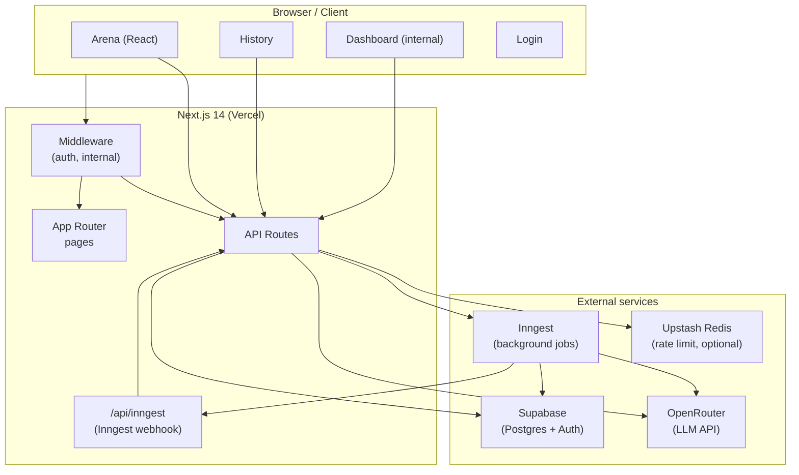
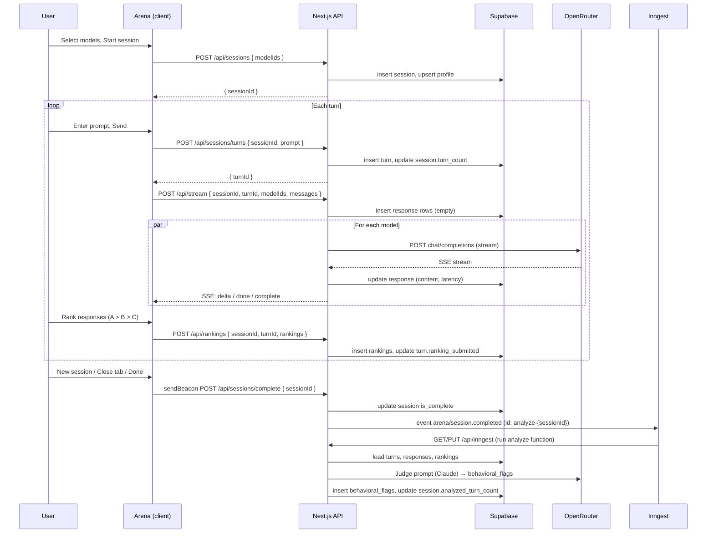

# Fleet Arena — Architecture

This document describes the system architecture, main flows, and the rationale behind key decisions.

> **Diagrams:** Additional Mermaid diagrams (system context, container view, data flow, ER) are in [architecture-diagrams.md](./architecture-diagrams.md).

---

## 1. High-level architecture diagram



---

## 2. Request and data flow

### 2.1 Arena session lifecycle



### 2.2 Auth and access control

```mermaid
flowchart LR
  subgraph Middleware
    A[Request] --> B{Path?}
    B -->|/api/internal/*| C{@fleet.so?}
    B -->|/dashboard/*| C
    B -->|/arena, /history| D{Logged in?}
    B -->|/api/stream, rankings, sessions| D
    C -->|No| E[403 / redirect]
    C -->|Yes| F[Next]
    D -->|No| G[401 / redirect login]
    D -->|Yes| F
  end
```

---

## 3. Component map

| Layer | Location | Purpose |
|-------|----------|---------|
| **Pages** | `src/app/**/page.tsx` | App Router pages; server components where we need auth or data. |
| **Clients** | `src/app/**/*Client.tsx` | Client components for arena, dashboard, behaviors, export. |
| **API routes** | `src/app/api/**/route.ts` | REST endpoints: sessions, turns, stream, rankings, analyze, internal. |
| **Inngest** | `src/inngest/*.ts`, `src/app/api/inngest/route.ts` | Background functions: session analysis, backfill. |
| **Middleware** | `src/middleware.ts` | Auth (Supabase), internal-domain check, API 401/403. |
| **Supabase** | `src/lib/supabase/server.ts`, `client.ts`, `edge.ts` | Server (cookies), browser client, edge/service-role. |
| **Shared** | `src/lib/models.ts`, `auth.ts`, `openrouter.ts`, `rateLimit.ts`, `upstashRateLimit.ts` | Config, auth helper, LLM key rotation, rate limiting. |
| **DB** | `supabase/schema.sql`, `supabase/migrations/*.sql` | Tables, RLS, triggers, indexes. |

---

## 4. Architecture decisions and rationale

### 4.1 Next.js 14 App Router + API routes

**Decision:** Use Next.js 14 with the App Router and colocated API routes under `src/app/api/`.

**Why:**
- Single repo and deployment for frontend and backend; no separate API server.
- Server Components for dashboard/history where we need server-side auth and data.
- API routes are the only serverful surface; they call Supabase, OpenRouter, and Inngest.
- Fits Vercel’s serverless model (per-request, scale-to-zero).

---

### 4.2 Supabase for database and auth

**Decision:** Use Supabase (Postgres + Auth) for persistence and user identity.

**Why:**
- One provider for DB and auth; RLS ties access to `auth.uid()`.
- Postgres supports arrays (`model_ids`), JSONB (metadata, evidence), and triggers (e.g. profile creation).
- Managed hosting, migrations, and connection pooling (important for serverless).
- Email OTP / magic link fits internal and test users without extra IdP.

---

### 4.3 Dual Supabase clients (anon vs service role)

**Decision:** Use two client types: cookie-based (anon) for user context, and service-role for backend writes and cross-user reads.

**Why:**
- **Anon + RLS:** Pages and middleware use `createClient()` (or server equivalent) so Supabase Auth and RLS enforce “user sees only their data.”
- **Service role:** API routes that create sessions, turns, responses, rankings, and behavioral flags bypass RLS and need a single privileged client; we use `createServiceClient()` (server) or `createEdgeServiceClient()` (Inngest/edge).
- Keeps a clear boundary: user context from cookies, privileged writes from env `SUPABASE_SERVICE_ROLE_KEY`.

---

### 4.4 OpenRouter for LLM calls

**Decision:** Use OpenRouter as the single LLM gateway for both arena responses and judge (analysis).

**Why:**
- One integration to call many models (Claude, GPT, etc.) with a single API shape.
- Support for streaming and for non-streaming judge calls.
- API key rotation via comma-separated keys in env (`OPENROUTER_API_KEY=key1,key2`) with round-robin in `getOpenRouterKey()`.
- Cost and rate limits are managed at OpenRouter; we add our own rate limiting (Upstash or in-memory) in front of `/api/stream`.

---

### 4.5 Arena: streaming via one route, N models in parallel

**Decision:** A single POST to `/api/stream` receives the full message history and `modelIds`; the handler starts N parallel OpenRouter streaming requests (one per model), writes response rows up front, then streams SSE back and updates each response row when that model’s stream finishes.

**Why:**
- User sees all models’ replies as they arrive without N separate tabs or calls.
- One HTTP request per turn keeps the client simple and avoids CORS and connection sprawl.
- Pre-inserting response rows avoids doing Supabase writes from inside the stream callback (which can be unreliable with `@supabase/ssr` in streaming contexts).
- Per-model timeout (e.g. 90s) and `maxDuration` (e.g. 300s) limit how long the route can run on Vercel.

---

### 4.6 Blind ranking (slot labels A/B/C, reveal after rank)

**Decision:** In the UI, responses are shown as slots A, B, C, …; model identities are hidden until the user submits a ranking for that turn.

**Why:**
- Reduces brand bias; ranking is based on content, not model name.
- Slot order is fixed by `session.model_ids`; ranking stores (slotLabel → rank), and we map to `response_id` using session’s model order.
- Simple mental model: “rank the slots,” then “see which model was which.”

---

### 4.7 Session completion and analysis via Inngest

**Decision:** When a session is “finished” (user starts a new session, closes tab, or explicit done), we call `/api/sessions/complete` or PATCH `/api/sessions`, which marks the session complete and sends an Inngest event `arena/session.completed` with a deduplication id `analyze-{sessionId}`. Inngest runs a function that loads session data, calls the judge LLM, and writes `behavioral_flags` and `sessions.analyzed_turn_count`.

**Why:**
- **No fire-and-forget HTTP:** Sending a one-off `fetch(/api/analyze)` from the route is brittle (timeouts, cold starts). Inngest gives a durable queue, retries, and step-based execution.
- **Deduplication:** Same event id means duplicate “session completed” events (e.g. beacon + PATCH) don’t run the job twice.
- **Idempotent analysis:** We only run the judge when `analyzed_turn_count` does not match current turn count; if the user resumes and adds turns then finishes again, we re-run and replace flags so we don’t miss new data.
- **Edge-compatible worker:** The Inngest function uses `createEdgeServiceClient()` and runs in an edge-like context with no Node-only APIs.

---

### 4.8 Behavioral analysis: LLM-as-judge, one run per session

**Decision:** After a session is complete, a single judge prompt (e.g. Claude) receives a structured summary of turns, responses, and rankings, and returns a JSON array of behavioral flags (refusal, context_loss, sycophancy, verbosity, rank_reversal). We persist these in `behavioral_flags` and set `sessions.analyzed_turn_count` so we can skip or re-run when the session is extended.

**Why:**
- One judge call per session keeps cost and latency predictable and avoids N judge calls per turn.
- Structured prompt and JSON output make it easy to map to our schema and to dashboard/export.
- Re-analysis when turn count changes ensures resumed sessions with new turns get judged; replacing old flags keeps a single consistent view per session.

---

### 4.9 Rate limiting: Upstash when available, in-memory fallback

**Decision:** Stream endpoint uses `checkStreamRateLimit(key)` from `upstashRateLimit.ts`, which uses Upstash Redis (sliding window, e.g. 20/min per key) when `UPSTASH_REDIS_REST_*` is set; otherwise it falls back to the in-memory rate limiter in `rateLimit.ts`.

**Why:**
- In serverless, in-memory state is per-instance; Upstash gives a global limit so one user can’t bypass by hitting different instances.
- Fallback allows local dev without Redis; production can enable Upstash for fair, global limits.
- Key is typically IP (or user id if we want per-user limits later).

---

### 4.10 Internal dashboard and domain gating

**Decision:** Dashboard, internal export, stats, and behaviors are behind routes that require the user to be logged in with an email ending in `@fleet.so` (or whatever `INTERNAL_EMAIL_DOMAIN` is). Middleware enforces this for `/dashboard` and `/api/internal/*`; route handlers use `requireInternalUser()` where needed.

**Why:**
- Single source of truth for “internal” (email domain); no separate admin DB or role table for initial rollout.
- Middleware returns 403 for internal API and redirects to login for dashboard so UX is consistent.
- Easy to extend later with a proper roles table or IdP group while keeping the same entry points.

---

### 4.11 Normalized metrics and Elo per turn

**Decision:** We store raw rankings (rank 1..N per turn). For analytics we compute: (1) **normalized rank** per turn as `(N - rank) / (N - 1)` and average it per model (0 = always last, 1 = always first); (2) **Elo** with a fixed total weight per turn (e.g. each turn contributes weight 1, spread across the N choose 2 pairs) so 2-way and 8-way turns are comparable.

**Why:**
- Raw average rank is not comparable across different N (e.g. 2 vs 8 models). Normalized rank and weight-normalized Elo make leaderboards and trends meaningful when we mix different session sizes.
- Win rate (share of rank-1) is already “one winner per turn” and comparable; we keep it and add normalized rank and Elo as complementary metrics.

---

### 4.12 Session recovery and completion from client

**Decision:** The arena client stores the active session id (and model ids) in localStorage. On load it tries to resume that session via GET `/api/sessions/resume?sessionId=...`. On “new session” or tab close it sends a beacon to POST `/api/sessions/complete` with the current session id. Resuming from history uses `?resume=<id>` and may complete a different in-memory session first via beacon.

**Why:**
- Users can refresh or open a second tab and return to the same session without losing progress.
- Beacon on unload best-effort completes the session and triggers analysis even if the user doesn’t click “Done.”
- Single “source of truth” for “current session” in the client (localStorage + optional resume param) keeps logic simple.

---

### 4.13 Monorepo layout: app, api, lib, inngest, supabase

**Decision:** Frontend and API live under `src/app/`; shared utilities and clients under `src/lib/`; Inngest functions and client under `src/inngest/`; schema and migrations under `supabase/`.

**Why:**
- Colocation of routes and pages with the App Router; clear separation between UI, API, and shared code.
- Inngest is a first-class citizen (event-driven background work), so a dedicated folder and a single serve() in `/api/inngest/route.ts` keeps triggers and functions easy to find.
- Supabase folder holds the single source of truth for schema and migrations, runnable via CLI or SQL editor.

---

## 5. Data model (summary)

- **profiles** — Extends auth.users; session/ranking counts, internal flag.
- **sessions** — model_ids, is_complete, turn_count, analyzed_turn_count, completed_at.
- **turns** — session_id, turn_number, prompt, ranking_submitted.
- **responses** — turn_id, model_id, content, latency_ms, token_count, finish_reason.
- **rankings** — turn_id, response_id, rank (1 = best).
- **behavioral_flags** — session_id, turn_id, model_id, flag_type, severity, description, evidence, confidence.

Relations and RLS ensure users only see their own sessions and related data; service role is used for writes and for internal/aggregate reads.

---

## 6. Deployment and environment

- **Hosting:** Next.js on Vercel (serverless functions + edge where applicable).
- **Database / Auth:** Supabase (Postgres + Auth); use pooler URL for serverless if recommended.
- **Env:** `NEXT_PUBLIC_SUPABASE_*`, `SUPABASE_SERVICE_ROLE_KEY`, `OPENROUTER_API_KEY`, `NEXT_PUBLIC_APP_URL`, `INTERNAL_EMAIL_DOMAIN`; optional `UPSTASH_REDIS_*` for global rate limiting; Inngest configured via dashboard and webhook to `/api/inngest`.

For step-by-step deployment, see [DEPLOY.md](../DEPLOY.md).
