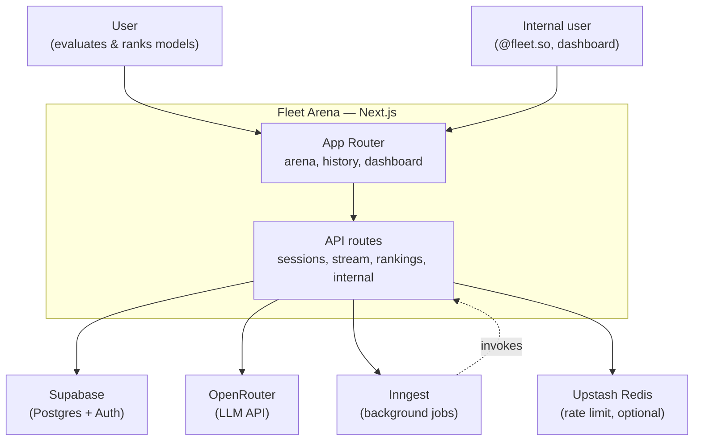
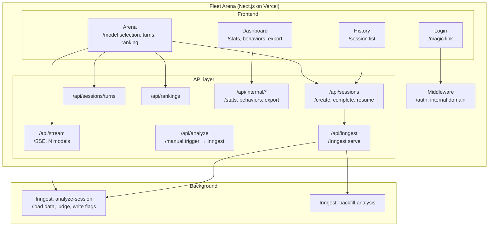
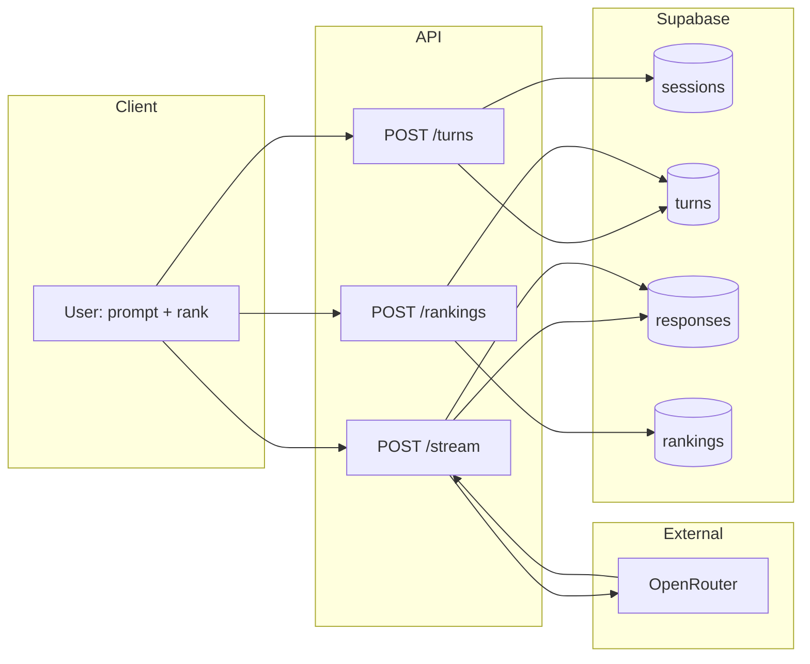
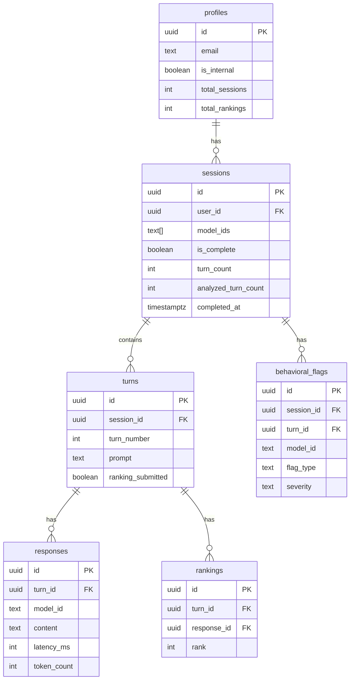

# Fleet Arena — Architecture diagrams

These Mermaid diagrams can be rendered in GitHub, GitLab, or any Mermaid-compatible viewer.

---

## System context (high level)

---

## Container view (Next.js app)

---

## Data flow: one arena turn

---

## Database entity relationship (simplified)

---

## Auth and routing matrix

| Route / path | Auth | Internal (@fleet.so) | Purpose |
|--------------|------|----------------------|---------|
| `/`, `/arena` | Optional (redirect if not logged in for arena) | No | Landing, arena |
| `/history`, `/sessions/[id]` | Required | No | User’s sessions |
| `/dashboard`, `/dashboard/*` | Required | Yes | Internal analytics |
| `/login` | Redirect if already logged in | No | Magic link login |
| `POST /api/sessions` | Required | No | Create / complete session |
| `POST /api/sessions/turns` | Required | No | Create turn |
| `POST /api/stream` | Required | No | Stream N model responses |
| `POST /api/rankings` | Required | No | Submit ranking |
| `POST /api/analyze` | Required | No (ownership check) | Manual trigger → Inngest |
| `GET/POST /api/internal/*` | Required | Yes | Stats, behaviors, export |
| `GET/POST/PUT /api/inngest` | Inngest signing | N/A | Inngest webhook |
